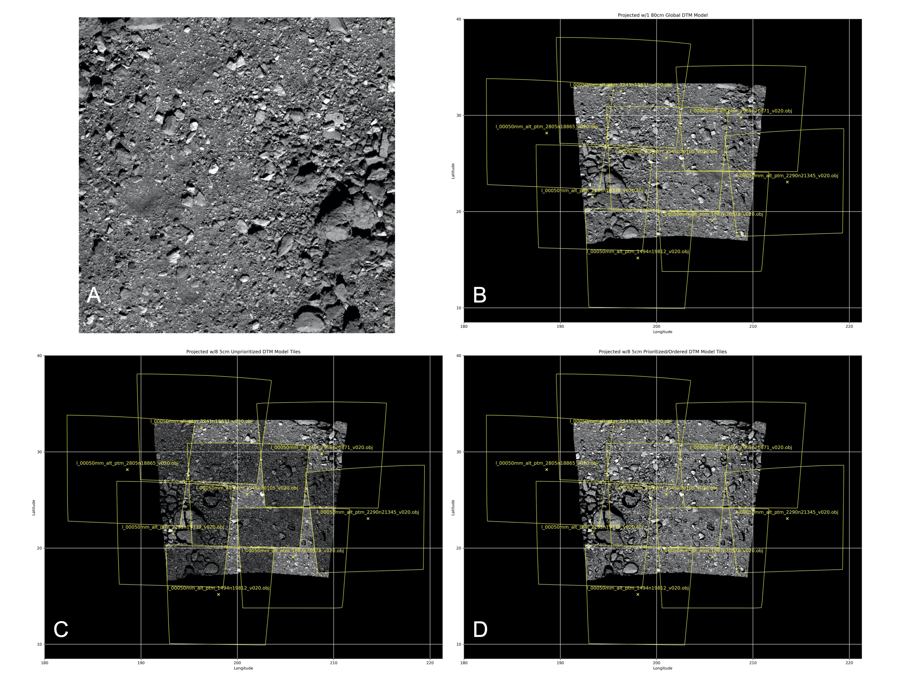

## **Discussion - API Design of ISIS Dependency Libraries**

- **Topic**: ISIS External Library Dependency API Design - __PSMRTS__
- **Date**: October 11, 2023
- **Author**: Kris J. Becker

## **Introduction**

The University of Arizona (UA) OSIRIS-REx (OREX) Image Processing Working Group (IPWG) has been funded to deliver ISIS software developed during the OSIRIS-REx encounter at asteroid 101955 Bennu to the USGS ISIS repository for distribution to the science community. This effort has been funded as part of the OREX extended mission now called OSIRIS-APophis EXplorer (APEX), which will orbit the asteroid 99942 Apophis shortly after a close Earth flyby in 2029.

We intend to provide the bulk of this work in the form of a shared library that will serve as an external ISIS build and runtime dependency. Our goal is to design the library such that it has utility and value outside of ISIS as a standalone package that can be used by the scientific community to aid in other research and development activities. This includes the USGS CSM environment among others. As such, we would like to solicit feedback and recommendations on best practices for design and implementation strategies that will help guide the development of this library.

## Enhanced Support for Small Body Cartography in the ISIS System

The features and capabilities in this library were identified as essential modifications and additions to the ISIS system that were required to meet the cartographic and mapping objectives of the OSIRIS-REx sample return mission from the surface of Bennu. While there were some basic capabilities in ISIS for support of small, irregular body cartography, further evaluation and testing identified additional requirements. New features were added to the ISIS 3.6 version and maintained and tested by the OREX/IPWG during three years of proximity operations at Bennu. These features and capabilities were also used in additional projects that involved mapping of 433 Eros (NEAR), 67P Churyumov-Gerasimenko (Rosetta), 19P Borrelly (Deep Space 1), 81P Wild 2 (Stardust), 9P Tempel 1 (Stardust-NExT, Deep Impact) and 103P Hartley 2 (EPOXI (Deep Impact)). Here is a summary of these features and capabilities enabled by this contribution:

- Implemented shape model instance sharing of Bullet shape models to enable use in *qview*, *qmos*, *findfeatures* and *jigsaw* applcations to name a few.
- Developed techniques to specify use of a ray tracing engine, such as Bullet, NAIF DSK and Embree in spiceinit that persists in each image thereafter.
- Added support for the OBJ format to the Bullet shape model.
- Implemented methods to specify multiple shape models that are shared for every image which significantly increases efficiency and eliminates out-of-memory errors due to redundant reloads of the same shape model.
- Implemented ray tracing prioritization of multiple shape models per image in the Bullet shape model system
- Implemented threaded loading of multiple shape models which significantly decreases startup times.
- Fixed Bullet facet partitioning that eliminates the need for USGS to maintain a special version of the Bullet library. This enables direct use of any Bullet library release.
- Fixed support for regional, non-global shape models.
- Fixes computations of emission and incidence angles due to stateful object errors in the NAIF DSK, Bullet and Embree shape models.
- Fixed issues in *noproj* where keywords were dropped that caused loss of ray trace engine history and resulted in errors in resulting image.
- Add explicit control of thread usage and ray tracing performance metrics.

These additions enabled the following capabilities and improvements in ISIS processing and mapping techniques.

- High precision foreground topography occlusion detection during orthorectified cartographic mapping.
- High precision sun illumination and shadowing detection. This is also a new backplane option added to *phocube* that can be used as a mask. It is also (optionally) considered in orthorectified mapping.
- Precise computations of local photometric angles and oblique pixel resolution.
- Runtime switching of ray trace engine and shape models without rerunning of *spiceinit*. This significantly improves support for *footprintinit*, *jigsaw* and orthorectified mapping as well as enhanced analysis and research activities (e.g., testing/comparisons of shape models in near real time).
- Development of simulated images from shape models for unsupervised feature matching and establishment of ground truth control networks.
- Enhanced and improved photometric products for scientific analysis.
- High precision control and orthorectified projections of cartographic global maps at 5 cm/pixel and 4 mm/pixel regional sample return site maps of Bennu.
- Full disk (i.e., flyby observations) control/bundle adjustment and geometric backplanes of various comets.
- Specialized application, *shape2map*, to convert tessellated shape models into ISIS 2.5D shape models.


## Implications for ISIS System

Upon completion and inclusion in the current ISIS version, this library will be used in an implementation of a new shape model class derived from the base class [ShapeModel](https://github.com/DOI-USGS/ISIS3/tree/dev/isis/src/base/objs/ShapeModel). This new shape model will fully replace and incorporate the functionality of the [NaifDskShape](https://github.com/DOI-USGS/ISIS3/tree/dev/isis/src/base/objs/NaifDskShape), [BulletShapeModel](https://github.com/DOI-USGS/ISIS3/tree/dev/isis/src/base/objs/BulletShapeModel) and [EmbreeShapeModel](https://github.com/DOI-USGS/ISIS3/tree/dev/isis/src/base/objs/EmbreeShapeModel) classes into a single ShapeModel class implementation. This will significantly reduce external build/runtime dependencies, code volume, and reduce maintenance costs of enhanced cartographic and geometric support for small irregularly shaped celestial bodies in the ISIS system.

## **Description**
In general, there will be several categories of contributions that the APEX team will deliver to the USGS/ISIS repository:

1. Bug fixes, application/class improvements/enhancements and new applications and classes
1. A shared library that provides enhanced, specialized cartographic support for small irregular bodies
1. Documentation and tutorials

Item 1 will consist of normal Issues/PR cycles as they are completed and prepared for inclusion into the ISIS system. In addition to software documentation, item 3 will provide tutorials focused on the UA/ISIS enhancements that were used to process image data of Bennu from the OREX OCAMS and NAVCAM instruments. Item 2 is the main topic of this document. This is a standalone shared library that incorporates all of ISIS' current small, irregular body shape model cartography features and capabilities. This includes support for the [NAIF digital shape kernels (DSK)](https://naif.jpl.nasa.gov/pub/naif/toolkit_docs/Tutorials/pdf/individual_docs/37_dsk.pdf), [Bullet Physics SDK](https://github.com/bulletphysics/bullet3), [Intel Embree](https://www.embree.org) ray tracing libraries. These libraries are specifically designed for specialized ray tracing of high resolution object (or shape) models that are essentially tessellated plate models.

Tessellated plate models consist of a set of floating point 3D vectors that represent surface points from the object body origin and a set of 3D integer indexes that refer to these vectors in the order in which they are stored (in memory). This configuration formulates interconnected triangles (commonly referred to as _facets_) which describe the topography of an object's surface. These models can be stored in files in a variety of forms including NAIF DSK, Wavefront's OBJ, PLY and various other 3D shape model formats. This system will not support ISIS 2.5D digital elevation models (DEM) directly and will not have an ISIS dependency.

### The Planetary Shape Model and Ray Tracing System Library
The new library, called the **`Planetary Shape Model and Ray Tracing System`**, (**PSMRTS**) will provide a C-based [application programming interface](https://en.wikipedia.org/wiki/API) (API) that is also [application binary interface](https://en.wikipedia.org/wiki/Application_binary_interface) (ABI) compatible. Through abstraction and [foreign function interfaces](https://en.wikipedia.org/wiki/Foreign_function_interface) (FFI), this shared library will provide the high precision cartographic capabilities in the UA/ISIS system that were developed for the OREX encounter at Bennu. For example, this system was used to produce a [global 5 centimeter resolution orthorectified cartographic mosaic map of Bennu](https://www.asteroidmission.org/bennu_global_mosaic/) and [4 millimeter pixel resolution regional mosaics](https://www.nasa.gov/feature/goddard/2020/osiris-rex-produces-nightingale-mosaic) of potential sample sites. UA/ISIS mainly used the Bullet ray tracing system for cartographic processing of OCAMS images. However the NAIF and Embree systems were also useful for a variety of activities during the mission. Hence, support for these systems will also be included in the `PSMRTS` library.

`PSMRTS` will focus primarily on support for small irregularly shaped celestial bodies. `PSMRTS` will be provided as an external dependency similar to ALE, SpiceQL and other third party libraries ISIS uses for build and runtime requirements. Internally in ISIS, we will provide a ShapeModel class that encapsulates the `PSMRTS` usage which will minimize the scope of required changes and ease maintenance. As per the build and installation requirements for ISIS, the `PSMRTS` shared library will be available on Anaconda as a conda-forge install package.

## **PSMRTS Objectives and Specifications**

The objective of this document regarding `PSMRTS` is to solicit feedback on design and implementation strategies that will help guide the development of this library. The goal is to provide a versatile and feature rich system that can maximize utility in many computing environments. `PSMRTS` will be a pure C++ system that provides a C-based API/ABI. Our main focus will be to determine and implement the best FFI design that offers the most utility, versatility and ease of adaptability of C-like wrappers in programming languages such as Python, Java, TypeScript, Rust, and others. We do not intend to provide or maintain any other wrappers other than the C API wrapper and will therefore rely on other contributors to provide these interfaces. We aspire to make development and maintenance of these FFIs as easy and simple as possible.

### PSMRTS  Features and Capabilities

The `PSMRTS` system is intended to replace the current ISIS small body cartography features and capabilities that currently exist in the system. During the OREX encounter at Bennu, the UA/IPWG significantly modified and enhanced support in an early version of the ISIS system. New capabilities were added in ISIS version 3.5.2 but for various reasons, were not at that time ported into any subsequent ISIS release.

Below are some of the capabilities and features of UA/ISIS that will be included in PSMRTS. The FFI will require APIs/ABIs that expose and/or make use of these utilities.

1. Provide a globally accessible, shareable pool of tessellated plate models comprised of 3D floating point vectors and indexes that create facet-based shape models and objects.
1. Initially provide support for and specification of NAIF DSK toolkit, Bullet and Embree ray tracing models for cartographic shape model configurations.
1. Ability to reuse existing shape models without creating or reloading copies of existing vector/index datasets.
1. Support sharing of existing ray tracing model instances to minimize initialization overhead.
1. Create prioritized ordering of ray tracing shape models by analysis and determination of most-to-least common ground coverage of high resolution shape models and camera FOV footprints.
1. Fundamental form of ray tracing is observer and look direction in body-fixed coordinates.
1. Avoid stateful shape models and ray tracing objects.
1. Prefer [stack allocation versus heap allocations](https://www.educative.io/blog/stack-vs-heap) where appropriate to minimize overhead and memory fragmentation and maximize efficiency.
1. Provide thread-safe and threading where appropriate/indicated.

### Examples of Existing Popular APIs
We have examples of various varieties of existing APIs in popular and widely used software systems. Many of these systems contain elements of FFI component design, and do not strictly adhere to or utilize a single feature of many possible FFI options. Most common FFI design/implementations use handles or opaque pointers. Each type has strengths and weaknesses, but we would like to hear from those who have experience with FFIs and help us make informed decisions that maximize usefulness and scope of `PSMRTS`.

Below are some examples of software systems that demonstrate uses of different forms and combinations of FFIs.

#### NAIF SPICE Toolkit
The [NAIF SPICE APIs](https://naif.jpl.nasa.gov/naif/toolkit.html) uses handles to refer to certain file references and objects utilized in a global parameter, variable and object pool. There are several language wrapper implementations provided with this toolkit. The Python [spiceypy](https://github.com/AndrewAnnex/SpiceyPy) wrapper is a widely used, independent wrapper of the NAIF [C API](https://naif.jpl.nasa.gov/naif/toolkit_C.html) toolkit.

The fundamental mechanism of the NAIF SPICE toolkit C API uses file handles to opened DSK shape models. All operations for ray tracing use the DSK file handle in its interface. Below is a small code example that issues a ray trace of a DSK.
The function [dasopr_c](https://naif.jpl.nasa.gov/pub/naif/toolkit_docs/C/cspice/dasopr_c.html) opens a DSK shape model and establishes a reference using a `handle`. The `handle` is an integer value that serves as a reference to a structure internal to the NAIF SPICE toolkit library that is used in all subsequent operations related to the ray tracing using this DSK file. The ISIS class [NaifDskPlateModel](https://github.com/DOI-USGS/ISIS3/blob/dev/isis/src/base/objs/NaifDskPlateModel/NaifDskPlateModel.cpp) shows the current implementation that will be replaced by the `PSMRTS` library.

```
// Open a DSK and obtain the handle
SpiceChar  dskfile  [ 1024 ];
SpiceInt   dskhandle;
dasopr_c( dskFile, &dskhandle );

// Get file descriptor
SpiceBoolean  found;
SpiceDLADescr dladsc;
dlabfs_ ( dskhandle, &dladsc, &found );
if ( !found ) {
     std::cerr << "No segments found in DSK file " + dskfile ;
     exit (1 );
}

//  Find first segment...
SpiceDSKDescr dladsc;
dskgd_c ( dskhandle, &dladsc, &dskdsc );

// ... set these body fixed observer position and look direction vector
SpiceDouble  observer[3]; // == get_bf_observer_location();
SpiceDouble  lookdir[3];  // == get_bf_camera_look_direction();

// Ray trace the look direction for dksfile shape model...
SpiceInt     plateid;
SpiceDouble  surfpt[3];
dskx02_c ( dskhandle, &dladsc, observer, lookdir,
           &plateid,  surfpt, &found);
if ( !found ) {
     std::cerr << "Body fixed intercept not found!";
     exit ( 2 );
}
```

#### GEOS Computational Geometry

The [GEOS](https://libgeos.org) computational geometry [C-API/ABI](https://libgeos.org/doxygen/geos__c_8h_source.html) uses structs and objects allocated on the heap and referenced using [opaque pointers](https://en.wikipedia.org/wiki/Opaque_pointer) to these objects. This FFI is used to create the Python library [shapely](https://github.com/shapely/shapely) wrap the GEOS library.

The following small [code example](https://libgeos.org/usage/c_api/#building-a-program) demonstrates use of the GEOS C-API that is based upon `opaque` pointers. This C-API is used in the ISIS system by the [GisTopology](https://github.com/DOI-USGS/ISIS3/blob/dev/isis/src/base/objs/GisTopology/GisTopology.cpp) and [GisGeometry](https://github.com/DOI-USGS/ISIS3/blob/dev/isis/src/base/objs/GisGeometry/GisGeometry.cpp) classes. Use of these classes is demonstrated in the [GisIntersectStrategy](https://github.com/DOI-USGS/ISIS3/blob/dev/isis/src/base/apps/isisminer/GisIntersectStrategy.cpp) class.

```
/* geos_hello_world.c */

#include <stdio.h>  /* for printf */
#include <stdarg.h> /* for va_list */

/* Only the CAPI header is required */
#include <geos_c.h>

/*
* GEOS requires two message handlers to return
* error and notice message to the calling program.
*
*   typedef void(* GEOSMessageHandler) (const char *fmt,...)
*
* Here we stub out an example that just prints the
* messages to stdout.
*/
static void
geos_msg_handler(const char* fmt, ...)
{
    va_list ap;
    va_start(ap, fmt);
    vprintf (fmt, ap);
    va_end(ap);
}

int main()
{
    /* Send notice and error messages to the terminal */
    initGEOS(geos_msg_handler, geos_msg_handler);

    /* Read WKT into geometry object */
    GEOSWKTReader* reader = GEOSWKTReader_create();
    GEOSGeometry* geom_a = GEOSWKTReader_read(reader, "POINT(1 1)");

    /* Convert result to WKT */
    GEOSWKTWriter* writer = GEOSWKTWriter_create();
    char* wkt = GEOSWKTWriter_write(writer, geom_a);
    printf("Geometry: %s\n", wkt);

    /* Clean up allocated objects */
    GEOSWKTReader_destroy(reader);
    GEOSWKTWriter_destroy(writer);
    GEOSGeom_destroy(geom_a);
    GEOSFree(wkt);

    /* Clean up the global context */
    finishGEOS();
    return 0;
}
```

This approach is being considered for maintaining results of ray traces where the returned constructs contain details such as the observer, look direction, status and surface intersections and normals from spacecraft instruments and light sources. Further computations can be made with these interfaces such as photometric data (e.g., emission, incidence and phase) as well as topographic occlusions.

#### TensorFlow Machine Learning Models

The [TensorFlow](https://www.tensorflow.org) machine learning system is developed mainly in C++. It is an [open source](https://github.com/tensorflow/tensorflow) platform for machine learning that provides [stable](https://www.tensorflow.org/guide/versions) Python and C++ APIs. The [C API](https://github.com/tensorflow/tensorflow/blob/master/tensorflow/c/c_api.h) is _designed toward simplicity and uniformity instead of convenience_.

## FFI Concepts
There are many other types of FFIs that can be used to produce C-APIs that are also application binary compatible (ABI). [Design guidelines](https://github.com/caiorss/C-Cpp-Notes/tree/master#miscellaneous) offer some ideas for FFI interfaces using mixed language programming techniques. We also intend to support the Windows platform. String handling is a fundamental need for most implementations and present challenges in mixed language environments.


## **PSMRTS Example**

The following short code segment is an example of what the `PSMRTS` C-API might look like. The observer is assumed to be provided in body fixed coordinates for a framing camera via the `spacecraft_body_fixed_position()` method. The look direction is provided in the  `body_fixed_look_direction_vector()` method in the `CameraModel` object.

```
CameraModel camera( "OREX", "OCAMS", observer_position_epoch );

PSMRTS_Object body = psmrts_init_object_tracer( "Bennu", PSMRTS_BULLET_SYSTEM );

psmrts_load_model( "l_00050mm_alt_ptm_2545n20105_v020.obj", body);
psmrts_load_model( "l_00050mm_alt_ptm_3241n19631_v020.obj", body);

double observer[3] = camera.spacecraft_body_fixed_position();
double lookdir[3];

for ( size_t line = 0 ; lines < camera.lines() ; line++ ) {
     for ( size_t sample = 0 ; camera.samples() ; sample++ ) {
          camera.body_fixed_look_direction_vector( line, sample, lookdir );
          PSMRTS_Raytrace ray = psmrts_intersect( body, observer, lookdir );
          if ( psmrts_raytrace_isvalid( ray ) ) {
               double radius = psmrts_radius( ray );
          }
     }
}
```

The figure below demonstrates the capabilities of the `PSMRTS` system.



### Details/Description of Figure 1.
Image A, 20190404T175836S168_pol_iofL2pan, was acquired of Bennu on January 4, 2019 at a distance of ~5km. It is radiometrically calibrated I/F with an average of ~7cm/pixel. Prior to projecting the image, it was controlled to ground using the shape model.

Image B is an orthorectified projected version of Image A into a equirectangular map using a 80cm global DTM. It has the outline of eight 5cm tessellated/faceted tiles superimposed over the map to provide context for Images C & D. The eight 5cm tiles, minimally and collectively, provide coverage of Image A ground FOV with nearly 35 million facets that are managed in the UA/ISIS Bullet Ray Tracing system for all geometric operations. In comparison, the 80cm global DTM has ~3.36 million facets for all of Bennu’s surface.

Image C is the same projection as Image B, but uses a list of 8 separate 5cm tiles without ray tracing prioritization. In this projection mode, all 8 5cm tiles are checked for surface intersection at each pixel. The tile containing the closest surface intercept is chosen and the body-fixed X, Y, Z coordinate of the DTM is converted to a corresponding latitude/longitude coordinate.

Image D is using the same list of 8 5cm tiles as Image C, but the ray trace from observer to surface is systematically applied to each 5cm tile, in the order provided in the DTM list, until a valid surface intercept is found. When the first valid surface intercept occurs, the other DTMs are not ray traced.

In Image C, you will notice significant anomalies that occurred during orthorectified mapping via ray tracing only in areas of common tile coverage. This indicates very slight (millimeter to centimeter) differences in common overlapping areas of the tiles. These differences are likely due to Poisson reconstruction being applied independently to each tile, resulting in minute differences in common areas, particularly on the edges of boulders and in large areas of differences in topography of the terrain. Image D does not show this same effect because of ray tracing prioritization of the DTM tile list and early termination upon the first surface intercept. It should also be noted that unprioritized processing takes significantly more time. The number of tiles that can be used for any single image is limited to the amount of memory available on the computer system.

### Objectives of this Discussion
Below are questions and topics of which we are requesting feedback and discussion from the ISIS and scientific community. This identifies the type of information we seek to aid and support the development, utility and adoption of this library.

1. We are hoping for constructive comments/suggestions regarding best practices to develop a diverse, yet simple, implementation of the C-API. The objective is to provide an easy API implementation to code for other languages such as Python, TypeScript, Rust, etc…
1. How should strings be handled?
1. We expect significant returns (numbers and volume) of data from ray traces. Some criticisms of the Bullet system is the use of significant allocated memory, which is costly to manage when utilized in an environment such as this and results in memory fragmentation and decreased performance. What are the best ways to prevent this that does not lead to development/data management problems and performance degradation (specifically, we expect an extremely large number of ray tracing operations will occur – at least two per pixel)?
1. What is the most effective and easiest use of threading? [Boost.Thread](https://theboostcpplibraries.com/boost.thread-management) has a feature that provides an [interrupt() mechanism](https://theboostcpplibraries.com/boost.thread-management#ex.thread_03) that may be used to cleanly (i.e., no corruption, memory leaks, reentrant state, etc…) early-terminate a thread. But this must be considered in the C++ implementation and the effort may not provide the expected benefits.
1. How many shape model formats should we support?
1. For OBJ (and potentially other formats), do we also retain and provide the metadata to decorate the object? This will increase the overhead and complexity (and will be targeted for a future revision).
1. For clarity, all the Qt dependencies will be removed in favor of C++ standards to minimize dependencies and target standardized constructs. What other standards/approaches should be used?
1. What is the best way to specify the list of (prioritized) shape models and which ray tracing engine is preferred by the (ISIS, specifically, but not exclusive) user?
1. What type/level of debugging and threading control do users want/need?


And some issues specific to ISIS:

10. How does an ISIS user specify which ray trace engine to use? UA/ISIS uses an IsisPreferences file, that contains a **ShapeModel** group, specifed in *spiceinit* only and records in the _Kernels_ group the **RayTraceEngine** keyword. This allows users to run *editlab* to change as needed/desired. This preserves the ray tracing engine until the kernel group disappears.
1. How should multiple shape model files be provided in *spiceinit*? In UA/ISIS, we specify a PVL file with a .conf file extension that contains a **ShapeModel** keyword containing the prioritized list of shape model files. This allows users to change the contents at will without any additional consideration. *editlab* can be run to set it to _Ellipsoid_ if needed. Whatever is used, _ShapeModelFactory_ must recognize this file and process appropriately.
1. The IsisPreferences file can also be used to further parameterize the ray trace engine. For example, you can specify the size (i.e., number of facets) of each partition in the UA/ISIS Bullet shape model. You can also add a one-time use of debugging and control use of threading upon loads for shape model files. You can also specify a **Tolerance** in meters of surface intercept precision. And how to behave should an error occur (e.g., continue to the next ray tracing engine or fail). How else might this be accomplished?
